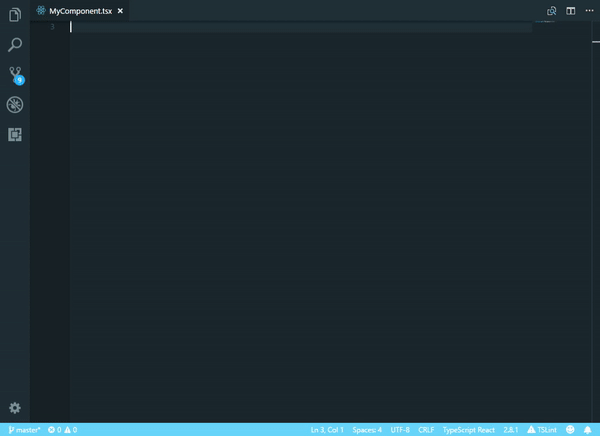

# Snippets for React/Redux (typescript) 

## Features

Add several useful snippets for react and redux development in typescript.

## Snippets

| Snippet                           | Renders                                         |
| --------------------------------- | ----------------------------------------------- |
| `importReact`                     | Import react                                    |
| `importReactAndRedux`             | Import react and redux                          |
| `reactComponent`                  | Generate react component                        |
| `reactComponentWithProps`         | Generate react component with props             |
| `reactComponentWithPropsAndState` | Generate react component with props and state   |
| `reactComponentWithRedux`         | Generate react component with redux             |
| `render`                          | Generate react render()                         |
| `componentWillMount`              | Generate react componentWillMount()             |
| `componentWillUpdate`             | Generate react componentWillUpdate()            |
| `componentDidMount`               | Generate react componentDidMount()              |
| `componentWillReceiveProps`       | Generate react componentWillReceiveProps()      |
| `reactTests`                      | Generate react tests with enzyme chai and sinon |

### 0.0.1

Initial release of Snippets for React/Redux (typescript)